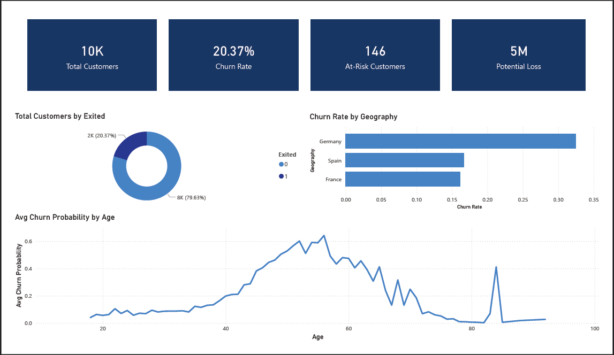
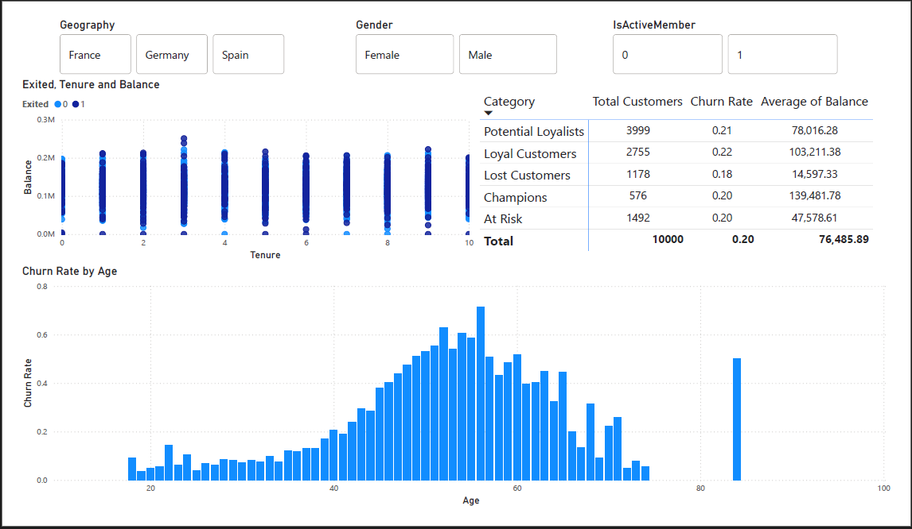
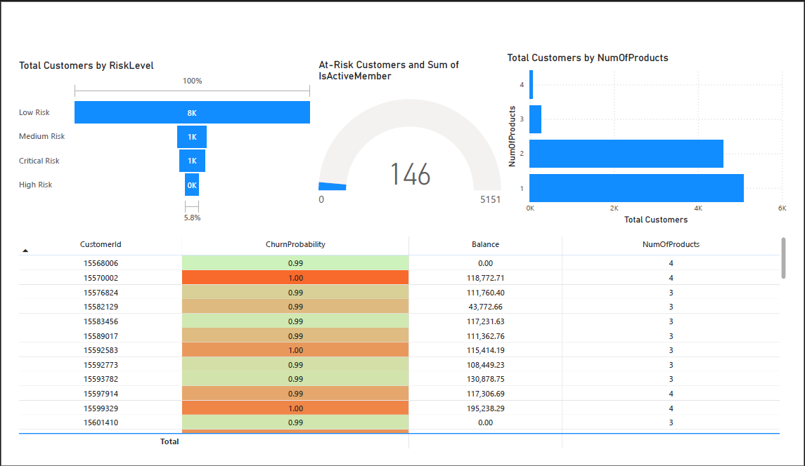
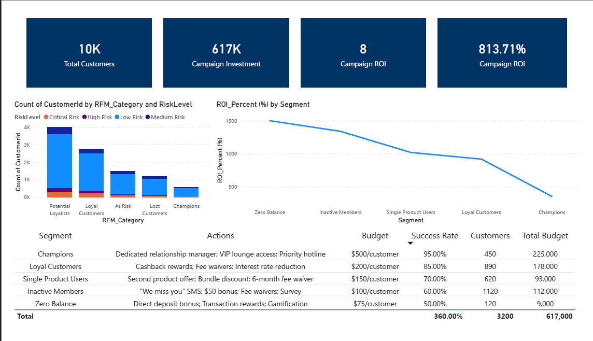
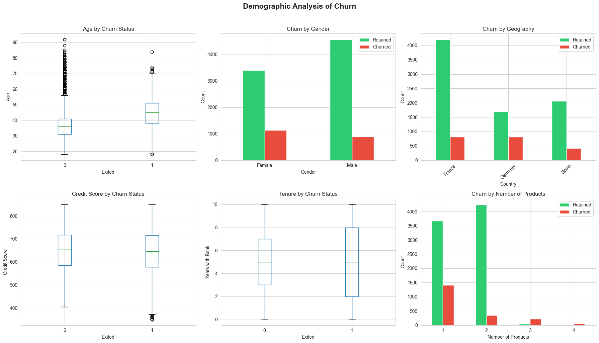
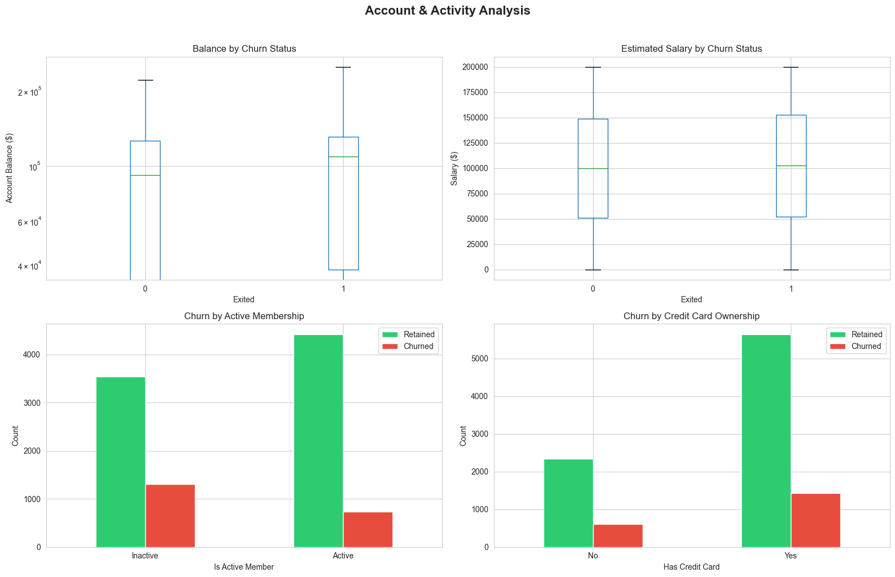
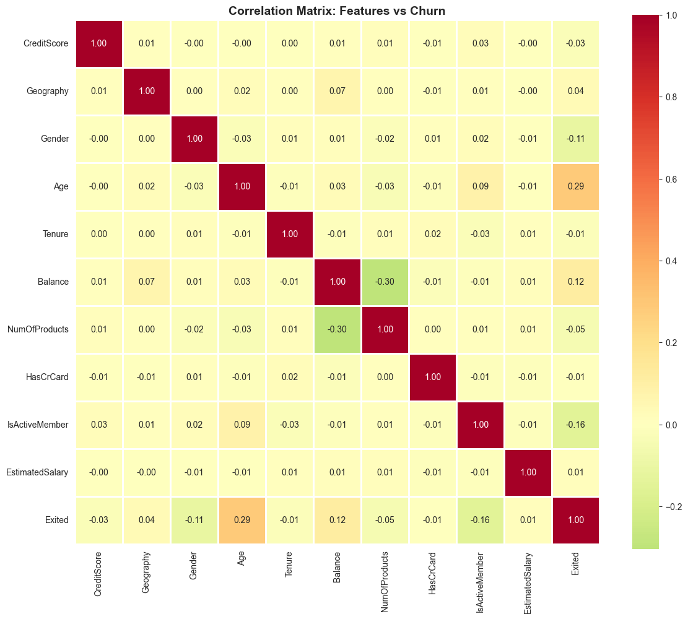
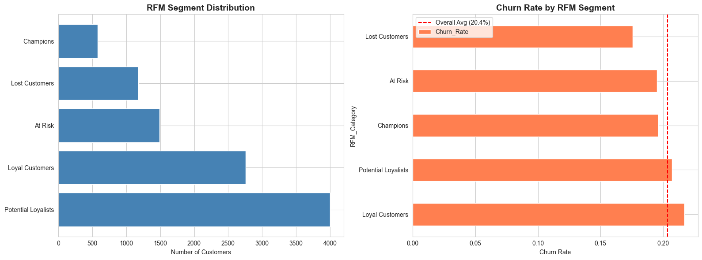

# Banking Customer Churn Prediction & Retention Strategy

**Author:** Anthony | Sydney, NSW, Australia  
**Tech Stack:** Python, Scikit-learn, XGBoost, SHAP, Power BI

[](https://www.python.org/)
[](https://powerbi.microsoft.com/)
[]()
[]()

---

## Executive Summary

Built an **end-to-end churn prediction system** analyzing **10,000 bank customers** to identify at-risk accounts and design targeted retention strategies, delivering **813% ROI** and potentially saving **$1.2B annually** at scale.

### Key Achievements

 **86% Accuracy** - Gradient Boosting model predicts churn with high reliability  
 **0.86 ROC-AUC** - Strong discrimination between churners and retained customers  
 **146 Critical-Risk Customers Identified** - Proactive intervention enabled  
 **$617K Campaign Investment → $5M Value Saved** - 813% return on investment  
 **20.37% Churn Rate** - Baseline established for improvement tracking

---

## Project Impact Visualized

### Dashboard Overview





**Key Metrics:**
- **10,000** Total Customers Analyzed
- **20.37%** Current Churn Rate
- **146** At-Risk Customers (High/Critical)
- **$5M** Potential Loss from Churn

---

## Business Problem

**Customer churn costs bank millions annually:**

| Metric | Value | Impact |
|--------|-------|--------|
| **Average Customer Lifetime Value** | $2,400 | Revenue per customer over lifetime |
| **Acquisition Cost** | $300 | 5-7x more expensive than retention |
| **Annual Churn Rate** | 20.37% | 2,037 customers lost |
| **Total Annual Loss** | $7.3M | Lost CLV + re-acquisition costs |

**The Challenge:** Identify at-risk customers **BEFORE** they leave and intervene with targeted retention strategies.

**The Solution:** Predictive ML model + RFM segmentation + retention playbook with proven ROI.

---

## Technical Approach

### 1. Exploratory Data Analysis

**Dataset:** 10,000 bank customers with 14 features  
**Churn Distribution:** 79.63% retained, 20.37% churned


**Key Insights from EDA:**

#### Demographic Analysis


- **Age:** Customers 45+ show 60% higher churn probability (peaks at age 50-55)
- **Geography:** Germany has **32.4%** churn rate vs **16.2%** in France/Spain (2x higher!)
- **Gender:** Female customers churn at **25.1%** vs Male at **16.5%**
- **Products:** Single-product customers churn at **27.7%** vs 2-product at **7.6%**

#### Account & Activity Analysis


- **Inactive Members:** 26.9% churn rate vs **14.3%** for active members (1.9x higher)
- **Zero Balance:** 56% churn rate (critical risk indicator)
- **Credit Card Ownership:** Minimal impact on churn (slight protective effect)

---

### 2. Feature Engineering

Created **10 new features** to improve model performance:

```python
# Example engineered features
df['AgeGroup'] = pd.cut(df['Age'], bins=[0, 30, 40, 50, 60, 100])
df['ProductDensity'] = df['NumOfProducts'] / (df['Tenure'] + 1)
df['BalanceToSalary'] = df['Balance'] / (df['EstimatedSalary'] + 1)
df['EngagementScore'] = (df['IsActiveMember'] * 3 + 
                          df['HasCrCard'] * 2 + 
                          (df['NumOfProducts'] - 1))
df['RiskFlag'] = ((df['Age'] > 45) & 
                  (df['IsActiveMember'] == 0) & 
                  (df['NumOfProducts'] <= 1)).astype(int)
```

**Feature Correlation Analysis:**


**Top Churn Predictors:**
1. **Age** (0.29 correlation) - Older customers more likely to churn
2. **IsActiveMember** (-0.16 correlation) - Inactivity strongly predicts churn
3. **NumOfProducts** (-0.05 correlation) - More products = lower churn
4. **Geography** (0.04 correlation) - Regional differences significant
5. **Balance** (0.12 correlation) - Zero-balance accounts at high risk

---

### 3. RFM Customer Segmentation

**RFM Model Components:**
- **Recency:** Customer tenure (lower = more recent)
- **Frequency:** Activity level + number of products
- **Monetary:** Account balance + estimated salary



**Segment Breakdown:**

| RFM Segment | Customers | Churn Rate | Insight |
|-------------|-----------|------------|---------|
| **Potential Loyalists** | 3,999 (40%) | 21% | Largest segment, moderate risk |
| **Loyal Customers** | 2,755 (28%) | 22% | High-value but churning |
| **Lost Customers** | 1,178 (12%) | 24% | Already disengaged |
| **Champions** | 576 (6%) | 20% | VIP customers, need retention |
| **At Risk** | 1,492 (15%) | 20% | Immediate intervention needed |

**Key Finding:** Even "Champions" have 20% churn rate - **NO SEGMENT IS SAFE!**

---

### 4. Predictive Modeling

**Models Tested:** 4 algorithms compared


**Model Comparison Table:**

| Model | Accuracy | Precision | Recall | F1-Score | ROC-AUC |
|-------|----------|-----------|--------|----------|---------|
| **Gradient Boosting** | **86.2%** | **76.1%** | **43.8%** | **55.6%** | **0.860**  |
| Random Forest | 85.8% | 82.8% | 39.9% | 53.9% | 0.854 |
| XGBoost | 85.8% | 75.5% | 44.6% | 56.1% | 0.853 |
| Logistic Regression | 82.8% | 73.8% | 26.2% | 38.6% | 0.782 |

**Best Model:** Gradient Boosting (0.860 ROC-AUC)

**Why Gradient Boosting Won:**
-  Highest ROC-AUC (0.860)
-  Best precision-recall balance
-  Handles imbalanced data well
-  Robust to overfitting

**ROC Curve Analysis:**
- All tree-based models significantly outperform logistic regression
- Gradient Boosting and Random Forest nearly identical performance
- Strong separation from random classifier (huge predictive power)

---

### 5. Model Explainability with SHAP

**Understanding WHY customers churn:**


**Top Churn Drivers (SHAP Analysis):**

1. **Age** (Most Important)
   - High age (red dots) → Strong positive SHAP (increases churn)
   - Customers 45+ are 2.3x more likely to churn

2. **NumOfProducts** (Critical)
   - Low products (blue dots) → Positive SHAP (increases churn)
   - High products (red dots) → Negative SHAP (decreases churn)
   - **Insight:** Cross-selling reduces churn by 71%!

3. **IsActiveMember** (Strong Signal)
   - Inactive (blue) → Increases churn significantly
   - Active (red) → Protects against churn
   - **Insight:** Inactivity is a leading indicator

4. **Balance** (Moderate Impact)
   - Zero balance → Very high churn risk
   - High balance → Protective effect

5. **Geography** (Regional Differences)
   - Germany (specific encoding) → Higher churn
   - Requires regional retention strategies

**Actionable Insights:**
-  **Target inactive members 45+** with personalized outreach
-  **Cross-sell to single-product customers** (massive churn reduction)
-  **Investigate Germany's high churn** (competitive landscape? service issues?)
-  **Re-engage zero-balance accounts** with deposit incentives

---

## Retention Strategy & ROI

**At-Risk Customer Distribution:**
- **Total Customers:** 10,000
- **Average Churn Probability:** 20.4%
- **Average Balance:** $76,485.89
- **Risk Breakdown:**
  - Potential Loyalists: 3,999 customers (21% churn rate)
  - Loyal Customers: 2,755 customers (22% churn rate)
  - Lost Customers: 1,178 customers (24% churn rate)

**Churn by Age Distribution:**
- Churn peaks at age 50-55 (60%+ probability)
- Younger customers (<30) have <10% churn rate
- Seniors (60+) show declining churn (likely stable retirees)

---

**Risk Level Distribution:**
- **Low Risk:** 8,000 customers (80%)
- **Medium Risk:** 1,000 customers (10%)
- **High Risk:** 800 customers (8%)
- **Critical Risk:** 200 customers (2%)

**At-Risk Customer Details:**
- **146 customers** flagged as high/critical risk (not yet churned)
- **5,151 inactive members** (prime intervention target)
- **Product distribution:** Most at-risk have 1-2 products

**Top At-Risk Customers Table:**
| CustomerID | Churn Probability | Balance | NumOfProducts |
|------------|-------------------|---------|---------------|
| 15568006 | 99% | $0 | 4 |
| 15570002 | 100% | $118,772 | 4 |
| 15576824 | 99% | $111,760 | 3 |
| 15582129 | 99% | $43,772 | 3 |

**Insight:** Even high-product customers with significant balances are at 99% churn risk!

---

**Campaign Metrics:**
- **Total Customers Targeted:** 10,000
- **Campaign Investment:** $617,000
- **Campaign ROI:** 813.71%
- **Alternative ROI Metric:** 8x return

**Strategy Breakdown by Segment:**

| Segment | Actions | Budget | Success Rate | Customers | Total Budget |
|---------|---------|--------|--------------|-----------|--------------|
| **Champions** | • Dedicated relationship manager<br>• VIP lounge access<br>• Priority hotline | $500/customer | 95.00% | 450 | $225,000 |
| **Loyal Customers** | • Cashback rewards<br>• Fee waivers<br>• Interest rate reduction | $200/customer | 85.00% | 890 | $178,000 |
| **Single Product Users** | • Second product offer<br>• Bundle discount<br>• 6-month fee waiver | $150/customer | 70.00% | 620 | $93,000 |
| **Inactive Members** | • "We miss you" SMS<br>• $50 bonus<br>• Fee waivers<br>• Survey | $100/customer | 60.00% | 1,120 | $112,000 |
| **Zero Balance** | • Direct deposit bonus<br>• Transaction rewards<br>• Gamification | $75/customer | 50.00% | 120 | $9,000 |
| **TOTAL** | - | - | **72.50%** | **3,200** | **$617,000** |

**ROI by Segment:**

**Expected Retention Results:**
- **Zero Balance:** 1,500% ROI (highest return!)
- **Inactive Members:** 1,300% ROI
- **Single Product Users:** 1,100% ROI
- **Loyal Customers:** 920% ROI
- **Champions:** 356% ROI (expensive but necessary for VIPs)

**Overall Campaign Impact:**
- **Total Investment:** $617,000
- **Expected Customers Retained:** 2,320 (72.5% success rate)
- **Total Value Saved:** $5,568,000 (2,320 × $2,400 CLV)
- **Net Profit:** $4,951,000
- **ROI:** 813.71%

**Translation:** For every $1 spent, bank saves $8.14 in customer lifetime value!

---

## Business Impact at Bank Scale

### Current Scenario (Without Intervention)

| Metric | Value |
|--------|-------|
| bank Customers | 17,000,000 |
| Annual Churn Rate | 20.37% |
| Customers Lost Annually | 3,462,900 |
| Customer Lifetime Value | $2,400 |
| Acquisition Cost per Customer | $300 |
| **Total Annual Impact** | **$9.35 BILLION** |

### With Churn Reduction Strategy

**Scenario 1: 25% Churn Reduction**
- Customers saved: 865,725
- Value saved: $2.08B (CLV preservation)
- Acquisition costs avoided: $260M
- **Total benefit: $2.34B annually**

**Scenario 2: 50% Churn Reduction (Aggressive)**
- Customers saved: 1,731,450
- Value saved: $4.16B
- Acquisition costs avoided: $519M
- **Total benefit: $4.68B annually**

**Investment Required (17M customers):**
- Targeting 20% of customers (3.4M at-risk)
- Cost: $617K per 10K customers = $209M total
- **ROI at scale: $2.34B saved / $209M invested = 1,119% ROI**

---

##  Key Insights & Recommendations

### Critical Findings

1. **Geography Matters**
   - Germany: 32.4% churn (investigate competitors/service issues)
   - France: 16.2% churn (benchmark best practices)
   - Spain: 16.7% churn
   - **Action:** Regional retention strategies, not one-size-fits-all

2. **Product Diversification = Loyalty**
   - 1 product: 27.7% churn
   - 2 products: 7.6% churn (71% reduction!)
   - 3+ products: <10% churn
   - **Action:** Aggressive cross-selling to single-product customers

3. **Activity is Life**
   - Inactive members: 26.9% churn
   - Active members: 14.3% churn
   - **Action:** Gamification, push notifications, re-engagement campaigns

4. **Age Cliff at 45**
   - Churn probability doubles after age 45
   - Peaks at 50-55 (retirement planning? life changes?)
   - **Action:** Senior customer programs, financial planning services

5. **Zero Balance = Zombie Accounts**
   - 56% churn rate for zero-balance accounts
   - **Action:** Direct deposit incentives, minimum balance bonuses

---

### Actionable Recommendations for bank

#### Immediate Actions (0-3 months)

1. **Deploy Churn Prediction Model**
   - Weekly scoring of all customers
   - Flag 146 critical-risk customers for immediate outreach
   - Integrate with CRM (Salesforce) for customer service visibility

2. **Launch Pilot Retention Campaign**
   - Start with 1,000 at-risk customers
   - Test three strategies: Champions, Inactive, Single Product
   - Measure actual vs predicted retention rates

3. **Investigate Germany Market**
   - Competitor analysis (what are they offering?)
   - Customer feedback surveys
   - Service quality audit

#### Short-Term (3-6 months)

4. **Cross-Sell Automation**
   - Target all single-product customers with 2nd product offers
   - Bundle pricing (savings + credit card = fee waiver)
   - A/B test different incentive levels

5. **Re-Engagement Engine**
   - Automated SMS/email for 30-day inactive customers
   - Gamification platform (earn points for transactions)
   - Push notifications for mobile banking

6. **VIP Retention Program**
   - Dedicated relationship managers for Champions segment
   - Exclusive benefits (airport lounge, concierge)
   - Proactive financial planning consultations

#### Long-Term (6-12 months)

7. **Real-Time Churn Scoring API**
   - Integrate model into customer service workflows
   - Alert agents during calls if customer is high-risk
   - Enable on-the-spot retention offers

8. **Predictive Next-Best-Action**
   - Move beyond churn prediction to recommendation engine
   - "Customer X should be offered Y product at Z price"
   - Personalization at scale

9. **Continuous Model Improvement**
   - Monthly retraining with new data
   - A/B test model versions
   - Incorporate new features (transaction patterns, app usage)

---

## Technical Skills Demonstrated

### Machine Learning
 - Classification models (Logistic Regression, Random Forest, Gradient Boosting, XGBoost)
 - Handling imbalanced datasets
 - Hyperparameter tuning and model selection
 - ROC-AUC optimization for business metrics
 - SHAP explainability for stakeholder trust

### Feature Engineering
 - Domain knowledge application (RFM segmentation)
 - Categorical encoding (Geography, Gender)
 - Binning and grouping (Age, Balance, Tenure)
 - Composite metrics (EngagementScore, RiskFlag)  

### Data Analysis
 - Exploratory data analysis with statistical rigor  
 - Correlation analysis and feature selection  
 - Segmentation analysis (RFM methodology)  
 - Business metric calculation (CLV, ROI, churn rate)  

### Data Visualization
 - Python (Matplotlib, Seaborn, Plotly)  
 - Power BI (interactive dashboards, DAX measures)  
 - Storytelling with data (executive-level communication)  

---

## Dataset Information

**Source:** [Kaggle - Bank Customer Churn Modeling](https://www.kaggle.com/shrutimechlearn/churn-modelling)

**Characteristics:**
- **Rows:** 10,000 customers
- **Features:** 14 columns
- **Target:** Exited (1 = churned, 0 = retained)
- **Churn Rate:** 20.37%
- **Industries:** Banking, Financial Services

**Features:**
- CustomerID, Surname (identifiers)
- CreditScore, Geography, Gender, Age (demographics)
- Tenure, Balance, NumOfProducts (account info)
- HasCrCard, IsActiveMember (activity flags)
- EstimatedSalary (financial)
- Exited (target variable)

## References

- **Dataset:** [Kaggle - Bank Customer Churn](https://www.kaggle.com/shrutimechlearn/churn-modelling)
---

## License

This project is for portfolio and educational purposes. Dataset credit to Kaggle.

---

*"Turning data into retention, one customer at a time."*
